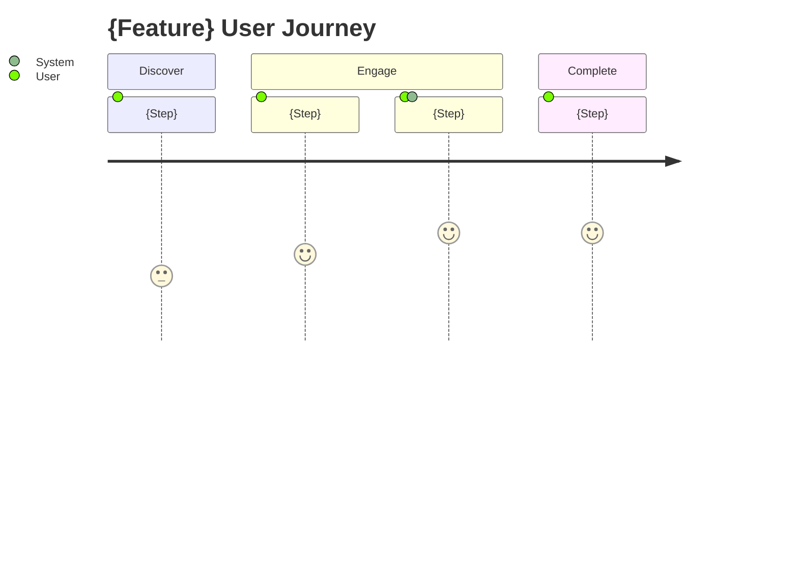
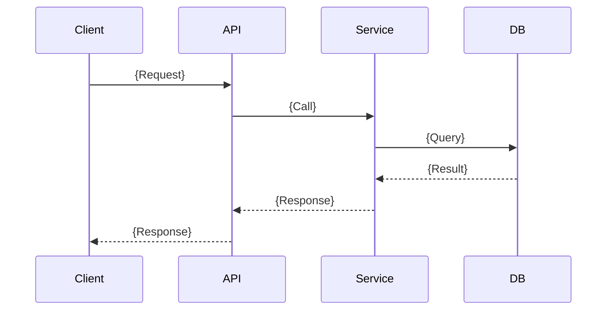

# 📋 {Product Name} — Product Requirements Document

> **Status:** Draft · **Version:** 0.1 · **Owner:** {Name} · **Updated:** {Date}

[[toc]]

---

## 🎯 Problem Statement

> One paragraph. What pain exists, for whom, and why it matters now.

{Problem statement here}

---

## 💡 Proposed Solution

{High-level description of the solution and its core value proposition.}

---

## 👥 Users & Personas

| Persona | Description | Primary Need |
|---------|-------------|--------------|
| {Name}  | {Who they are} | {What they need} |
| {Name}  | {Who they are} | {What they need} |

---

## 🗺️ User Journey



---

## ⚙️ Functional Requirements

### Must Have

- [ ] {Requirement 1}
- [ ] {Requirement 2}
- [ ] {Requirement 3}

### Should Have

- [ ] {Requirement 4}
- [ ] {Requirement 5}

### Nice to Have

- [ ] {Requirement 6}

---

## 🚫 Out of Scope

- {Thing explicitly not being built}
- {Another exclusion}

---

## 🔄 System Flow

```mermaid
flowchart TD
    A([User]) --> B[{Entry point}]
    B --> C{Decision}
    C -->|Yes| D[{Happy path}]
    C -->|No| E[{Alternate path}]
    D --> F([Done])
    E --> F
```

---

## 🏗️ Technical Architecture

```mermaid
graph LR
    subgraph Client
        UI[{Frontend}]
    end
    subgraph Server
        API[{API Layer}]
        SVC[{Service}]
    end
    subgraph Data
        DB[({Database})]
    end
    UI --> API --> SVC --> DB
```

---

## 📡 API / Interface Design



---

## 📊 Success Metrics

| Metric | Baseline | Target | Measurement |
|--------|----------|--------|-------------|
| {Metric 1} | {Value} | {Value} | {How measured} |
| {Metric 2} | {Value} | {Value} | {How measured} |

### Key Formula

$$
\text{Success Rate} = \frac{\text{Completed}}{\text{Attempted}} \times 100
$$

---

## 🗓️ Milestones

```mermaid
gantt
    title {Feature} Roadmap
    dateFormat YYYY-MM-DD
    section Discovery
        Research & scoping     :done,    d1, {start}, {end}
    section Design
        UX design              :active,  d2, {start}, {end}
        Design review          :         d3, after d2, {duration}
    section Build
        Backend                :         b1, {start}, {duration}
        Frontend               :         b2, after b1, {duration}
    section Launch
        QA & hardening         :         l1, after b2, {duration}
        Rollout                :         l2, after l1, {duration}
```

---

## ⚠️ Risks & Mitigations

| Risk | Likelihood | Impact | Mitigation |
|------|-----------|--------|------------|
| {Risk 1} | High / Med / Low | High / Med / Low | {Mitigation} |
| {Risk 2} | High / Med / Low | High / Med / Low | {Mitigation} |

---

## 🔗 Dependencies

- **{Team/System}** — {What you need from them}
- **{Team/System}** — {What you need from them}

---

## ❓ Open Questions

- [ ] {Question 1} — Owner: {Name} · Due: {Date}
- [ ] {Question 2} — Owner: {Name} · Due: {Date}

---

## 📎 References

- [{Link title}]({url})
- [{Link title}]({url})
